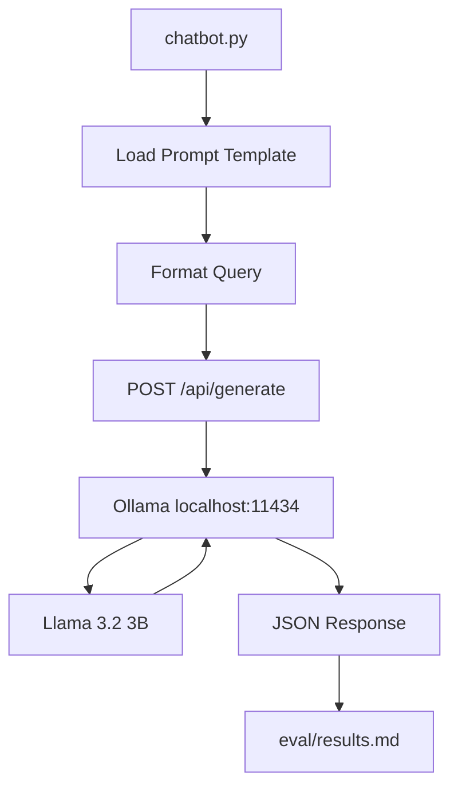

# Architecture

## Components

- `chatbot.py`: orchestrates prompts, requests, and logging
- `prompts/*.txt`: zero-shot and one-shot templates
- `Ollama`: local inference API
- `eval/results.md`: evaluation output + manual scoring
- `static/*`: optional UI for live chat testing
