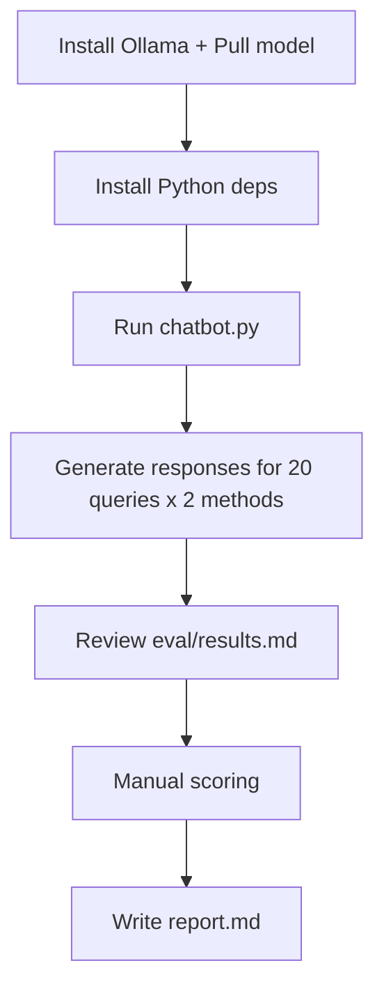

# Workflow

## Steps

1. Install Ollama and `llama3.2:3b`.
2. Create venv and install `requirements.txt`.
3. Run `python chatbot.py`.
4. Score responses in `eval/results.md`.
5. Complete `report.md`.
